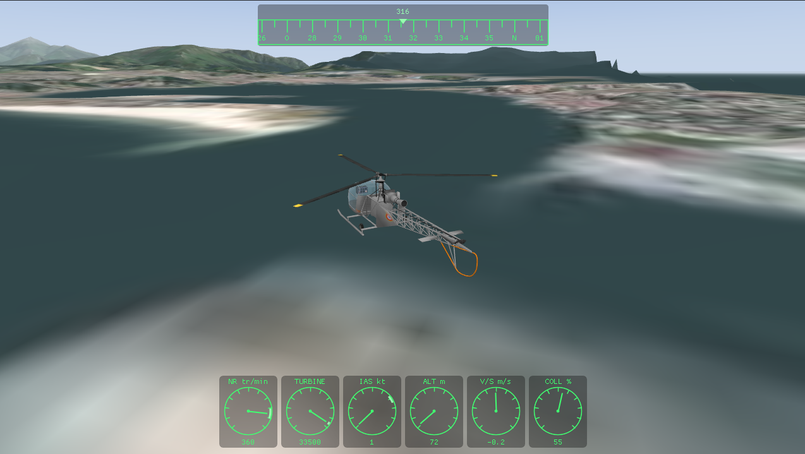

# Artouste



Simulateur de pilotage 3D de l'hélicoptère **Aérospatiale Alouette II**
(SE.3130), en C++ moderne et OpenGL. Vol jouable au clavier ou à la manette,
modèle de vol simplifié mais reconnaissable, rendu temps réel sans moteur de
jeu lourd.

## Fonctionnalités

- Modèle de vol Newton-Euler (poussée, gravité, traînée, moments cycliques,
  anti-couple), effet de sol et effet de translation, intégration à pas fixe.
- Démarrage et arrêt de la turbine Artouste en deux temps (la turbine monte en
  régime, puis le rotor s'accélère) : il faut la lancer pour décoller.
- Entrées clavier et manette Xbox (détection automatique de la source).
- Trois vues (cycle avec `C`) : poursuite, cockpit, orbite.
- HUD transparent à trois modes (cycle avec `H`) : panneaux dans les coins,
  instruments ronds verts superposés (Super HUD), ou rien.
- Son moteur et rotor, ciel en dégradé, ombre portée.
- Modèle 3D réel optionnel (voir ci-dessous) ; sinon, hélicoptère procédural.

## Commandes

| Action                  | Clavier        | Manette              |
|-------------------------|----------------|----------------------|
| Collectif +/-           | `W`/`Z` / `S`  | RT / LT              |
| Cyclique                | flèches        | stick gauche         |
| Palonniers              | `D` / `A`/`Q`  | stick droit (X)      |
| Turbine (démarrer/couper) | `T`          | bouton `Start`       |
| Vue (poursuite/cockpit/orbite) | `C`     | bouton `Y` (jaune)   |
| HUD (coins/superposé/aucun) | `H`        | bouton `B`           |
| Pause                   | `P`            | bouton `Back`        |
| Reset position          | `R`            | bouton `X`           |
| Quitter                 | `Échap`        | `LB` + `RB`          |

## Compilation (Linux)

```bash
cmake -S . -B build -DCMAKE_BUILD_TYPE=Release
cmake --build build -j
ctest --test-dir build --output-on-failure
./build/bin/artouste
```

Dépendances récupérées automatiquement (FetchContent) : GLFW, GLAD, GLM,
Dear ImGui, Assimp, stb, miniaudio, Catch2. Prérequis système : pilotes
OpenGL, bibliothèques X11/Wayland, et un compilateur C++20.

## Packaging

```bash
cmake -S . -B build -DCMAKE_BUILD_TYPE=Release
cmake --build build -j
cd build && cpack
```

Produit une archive `artouste-<version>-<système>.tar.gz` contenant le binaire
et les shaders.

## Modèle 3D et sons

Le modèle 3D de l'Alouette II et les sons proviennent du paquet **FlightGear**
de Emmanuel Baranger (helijah), sous licence GPL. Le sous-ensemble utilisé par
le simulateur (modèles `.ac`, textures, deux boucles sonores) est inclus dans
ce dépôt avec le fichier `COPYING` d'origine. Source :
<http://helijah.free.fr/flightgear/les-appareils/alouette2/appareil.htm>. S'ils
sont absents, l'application affiche un hélicoptère procédural et reste
silencieuse.

## Licence

Ce projet est distribué sous licence **GPL v2** (voir `LICENSE`), comme le
modèle 3D et les sons d'Emmanuel Baranger qu'il inclut.
