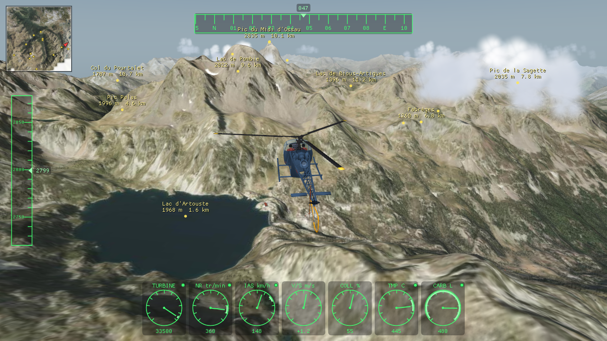

# Artouste

**Site de présentation : [obook.github.io/artouste](https://obook.github.io/artouste/)**

Artouste est un simulateur de vol personnel consacré au pilotage 3D de l'hélicoptère **Aérospatiale Alouette II** SE.3130.

Son objectif est de restituer fidèlement la séquence de démarrage de la turbine Turboméca puis des rotors, le comportement en vol de cet appareil sans servo-commandes dans une ambiance sonore caractéristique de sa turbine et de ses trois pales.

Ce n'est ni un jeu ni une reconstitution exhaustive, mais une tentative de retrouver les sensations remarquables de pilotage de cet appareil.



Artouste modélise l'Alouette II SE.3130 avec une précision que FlightGear n'atteint pas sur cet appareil : séquence de démarrage en six états calée sur la turbine Artouste IIC, roue libre simulée, sens de rotation du rotor et compensation anti-couple codés, mode assisté découplé de la physique.

Écrit en C++ moderne et OpenGL, le pilotage est jouable au clavier ou à la manette. Le modèle de vol est simplifié mais reconnaissable, le rendu temps réel sans aucun moteur de jeu.

## Histoire

L'Alouette II n'était pas destinée à devenir une légende.

Conçue par la Société nationale des constructions aéronautiques du Sud-Est (SNCASE) au
milieu des années 1950, elle fut le premier hélicoptère de série au monde à voler
grâce à une turbine à gaz, ouvrant à l'appareil des altitudes jusque-là hors de
portée. Elle a aussi marqué le cinéma, de Fantômas à James Bond. Voir
[docs/HISTOIRE.md](docs/HISTOIRE.md) pour le récit complet.

<div align="center">

_Alouette II SNCASE SE.3130 - Musée de l'ALAT et de l'hélicoptère - Dax (40)_</div>

## Démarrage rapide

> [!NOTE]
> **Au lancement**, le simulateur s'ouvre sur un menu de choix : la
> carte à charger et le démarrage éventuel de la turbine. En vol, `Échap` (ou `LB` + `RB` à la manette) ramène à ce menu ; dans le menu, `Échap` quitte le simulateur.

> [!TIP]
> La notice des commandes est disponible au téléchargement : [notice.pdf](docs/notice.pdf)
> 
> **Première fois aux commandes ?**
> Voici les trois étapes pour effectuer sans stress votre premier vol à bord de l'Alouette.
> 1. **Activez le mode assisté** : touche `M` | croix directionnelle haut, un message à l'écran le confirme.
> 2. **Démarrez la turbine** avec la touche `T` | bouton `Start`, la préparation avant de pouvoir décoller prend environ 60 secondes :
>    * La turbine monte seule en régime jusqu'à 33 500 tr/min
>    * Le frein rotor est automatiquement relâché, les pales commencent leur rotation puis le rotor atteint son régime de vol
> 3. **Décollage et vol.** Une fois le rotor en régime :
>    * augmentez doucement le collectif (touche `Z` | gâchette `RT`) jusqu'à un peu plus de 50 % pour décoller de quelques mètres du sol
>    * inclinez l'appareil au cyclique vers l'avant (flèches | stick gauche) et avancez
>    * compensez le couple avec le palonnier (touche `D` à droite, `A` ou `Q` à gauche | stick droit)
>    * réduisez le collectif (touche `S` | gâchette `LT`) pour redescendre.

> [!NOTE]
> **Envie d'une démo ?**
> À partir du menu, appuyer sur la touche `D` : l'appareil effectue seul,
> en boucle, un vol panoramique au-dessus du bassin d'Arcachon. La touche `Échap` ou une action franche sur le manche en sort.

## Fonctionnalités du simulateur

* Modèle de vol Newton-Euler (poussée, gravité, traînée, moments cycliques, anti-couple), effet de sol et effet de translation, intégration à pas fixe.
* Effets liés à l'altitude et au domaine de vol : la portance et la puissance de la turbine décroissent quand on monte, au point d'interdire le stationnaire en haute montagne (vers 3 300 m), conformément à la vocation montagnarde de l'Alouette II. Au-delà de la vitesse à ne pas dépasser (VNE, plus basse en altitude), une traînée d'onde freine l'appareil. Le vol latéral ou arrière prononcé réduit l'autorité au palonnier. Une descente verticale rapide à faible vitesse fait décrocher le rotor (vortex ring state), dont on se dégage en reprenant de la vitesse vers l'avant. Toutes ces difficultés sont désactivées en mode assisté, pendant la démo et pendant l'atterrissage automatique, où le vol reste facile et prévisible.
* En vue cockpit, une légère vibration de la cabine traduit le passage des trois pales du rotor. L'effet est purement visuel et n'agit pas sur la physique.
* Démarrage et arrêt de la turbine Artouste en deux temps. La turbine monte en régime, puis le rotor s'accélère, il faut la lancer pour décoller (touche `T`).
* Entrées clavier et manette (détection automatique de la source). Manette Xbox, ou manette PlayStation 4 (DualShock 4) / PlayStation 5 (DualSense) en USB ou Bluetooth. La base communautaire de correspondances SDL (`assets/gamecontrollerdb.txt`) est chargée au lancement : elle étend la reconnaissance à un large éventail de manettes, dont les modèles Xbox récents en Bluetooth que la base intégrée de GLFW ne couvrait pas.
* Mode assisté (touche `M`) : couche de confort qui compense le lacet, ramène le cyclique au neutre, lisse les commandes et borne le collectif, sans toucher à la physique. La bascule est progressive.
* Atterrissage automatique (touche `J` / stick droit) : engage le pilote automatique vers l'hélipad le plus proche (dans un rayon de 999 m, sinon la touche n'a aucun effet), qui rejoint la pente d'approche du HAPI (6 %), se pose en douceur et rend la main une fois le collectif ramené au sol. Une action franche sur le manche ou le collectif désengage l'atterrissage automatique et rend la main tout de suite (les palonniers sont exclus de cette détection : à la manette, le déclencheur est le clic du stick droit, qui en est aussi l'axe).
* Commandes animées dans la cabine : palonnier, manche cyclique (la main droite suit) et levier de collectif (la main gauche se pose dessus et le suit).
* Quatre vues (cycle avec `C`) : poursuite, cockpit, orbite et orbite solaire, cette
  dernière plaçant la caméra face au soleil pour mettre en valeur le ciel.
* HUD transparent à trois modes (cycle avec `H`) : panneaux dans les coins,
  instruments ronds verts superposés (Super HUD) ou rien. Le panneau supérieur droit
  affiche l'heure du simulateur (ligne `HRE`), avec un deux-points clignotant. En mode
  coins, le coin bas-droit indique aussi le nombre d'images par seconde (FPS).
  Cinq paramètres sont surveillés par une alarme à trois états (vert = normal,
  jaune = surveiller, rouge = limite franchie) : régime rotor (autour de la bande
  nominale, inhibée tant que le rotor n'est pas en régime), régime turbine (verte
  au régime, elle sert d'indicateur "turbine prête" au démarrage), vitesse (sur la
  VNE réelle du moment, qui décroît avec l'altitude), température tuyère et
  carburant (jaune sous 60 L, rouge sous 15 L). En Super HUD, l'alarme est une LED
  en haut à droite du cadran ; en HUD coins, la ligne concernée passe au jaune ou
  au rouge.
* Balise HAPI (Helicopter Approach Path Indicator) sur le pad de départ de chaque
  carte : un repère au sol qui indique la pente d'approche par sa couleur, selon
  les seuils du guide DGAC/STAC -- vert clignotant si trop haut, vert fixe sur la
  pente, rouge fixe légèrement trop bas, rouge clignotant si trop bas. Le point de
  l'étiquette HUD (coin ou minimap) reprend cette couleur, qu'il s'agisse du pad
  lui-même ou d'un lieu remarquable qui coïncide avec lui (l'aérodrome de
  Dax-Seyresse, par exemple) ; hors des seuils, le point s'éteint plutôt que de
  passer à une couleur intermédiaire. Données par carte dans un fichier optionnel
  `hapi.txt` (`lon lat azimut_deg pente_pct nom`), voir [docs/CARTES.md](docs/CARTES.md).
* Interface à l'échelle de la fenêtre : le HUD (rubans, cadrans, réticule, minimap,
  étiquettes) et le menu de démarrage suivent la taille réelle de l'affichage
  (référence 1280x720, facteur borné de 0,75 à 3,5), et la police est reconstruite
  nette à chaque changement de taille. L'affichage reste lisible et proportionné
  du petit fenêtré au plein écran 4K, y compris en fenêtre étroite.
* Cycle jour/nuit : le soleil suit sa course et colore le ciel au fil des heures, de
  l'aube au coucher orangé puis à la nuit, en orientant l'éclairage de toute la scène.
  La vitesse du temps se règle dans `assets/config.txt` (`sun_time_scale`) : par
  défaut, une journée complète défile en vingt minutes, mais on peut aussi choisir le
  temps réel (heure du PC), un autre rythme, ou figer le temps à midi. La nuit, les deux
  feux de position avant s'allument, rouge à bâbord et vert à tribord.
* Mode démo automatique (bouton `Démo` du menu de démarrage) : l'appareil joue seul,
  en boucle, un vol panoramique au-dessus du bassin d'Arcachon (démarrage accéléré de
  la turbine puis embrayage du rotor à vitesse réelle, décollage, survol de la Dune du
  Pilat à 2000 m, passage bas sur la pointe nord du cap Ferret, survol d'Arcachon à
  1000 m, retour et pose). Pendant la démo, la touche `Échap`, ou une action franche
  sur le manche, en sort et ramène au menu de démarrage ; la vue (`C` ou bouton `Y`),
  le HUD (`H` ou bouton `B`), le plein écran (`F`) et la radio (`K`, `-`/`+`) restent
  actifs sans l'interrompre.
* Son du moteur et du rotor, ciel en dégradé, ombre portée.
* Radio internet optionnelle (touche `K`) : un flux MP3 configurable joué dans le
  cockpit sous les sons moteur, avec un voyant `RADIO` dans le HUD.
* Effets moteur quand la turbine tourne, flash rouge anti-collision sur le toit de
  la cabine et tuyère (distorsion thermique de l'air chaud, halo bleuté à la sortie de la turbine).
* Modèle 3D réel optionnel (voir ci-dessous) ; sinon, hélicoptère procédural.

## Commandes

| Action                  | Clavier        | Manette              |
|-------------------------|----------------|----------------------|
| Collectif +/-           | `Z` / `S`      | RT / LT              |
| Cyclique                | flèches        | stick gauche         |
| Recentrer le cyclique   | `Espace`       | -                    |
| Palonniers              | `D` / `Q`      | stick droit (X)      |
| Turbine (démarrer/couper) | `T`          | bouton `Start`       |
| Vue (poursuite/cockpit/orbite/orbite solaire) | `C` | bouton `Y` (jaune) |
| Livrée (blanche/Gendarmerie/armée de terre/Protection civile) | `L` | bouton `A` (vert) |
| Mode assisté (confort)  | `M`            | croix directionnelle haut |
| Atterrissage automatique (pad le plus proche) | `J` | stick droit (clic ; `R3` sur PS4/PS5) |
| HUD (coins/superposé/aucun) | `H`        | bouton `B`           |
| Plein écran (fenêtré/plein écran) | `F`  | -                    |
| Pause                   | `P`            | bouton `Back`        |
| Démo : lancer / sortir  | menu `Démo` (ou `D`) / `Échap` | lancer : bouton `Y` (menu) ; sortir : `Échap`/`B`, ou reprendre le manche |
| Radio internet (allumer/couper) | `K`    | -                    |
| Balance radio/hélico    | `-` / `+`      | -                    |
| Reset position          | `R`            | bouton `X`           |
| Retour au menu          | `Échap`        | `LB` + `RB`          |

Les boutons sont nommés à la Xbox, mais une manette PlayStation 4 (DualShock 4) ou PlayStation 5 (DualSense) branchée en USB ou en Bluetooth fonctionne aussi : le mappage GLFW/SDL fait correspondre `A`/`B`/`X`/`Y` à Croix/Rond/Carré/Triangle, `Start` à `Options` et `Back` à `Share`/`Create`.

Cette reconnaissance étendue s'appuie sur la base communautaire SDL embarquée (`assets/gamecontrollerdb.txt`), chargée au démarrage. Elle couvre plusieurs centaines de manettes sur Linux, Windows et macOS, dont les modèles Xbox sans fil récents (Series X/S) en Bluetooth, absents de la base intégrée de GLFW. Pour rester à jour au fil des nouveaux modèles, il suffit de remplacer ce fichier par la dernière version publiée sur le dépôt [SDL_GameControllerDB](https://github.com/mdqinc/SDL_GameControllerDB).

## Téléchargement

Des exécutables prêts à l'emploi pour Linux et Windows sont publiés dans la
section [Releases](https://github.com/obook/artouste/releases) du dépôt. Chaque
archive est autonome : décompressez-la et lancez `artouste` (Linux) ou
`artouste.exe` (Windows), les ressources sont à côté du binaire. Les archives
sont construites automatiquement par GitHub Actions à chaque version
(voir `.github/workflows/release.yml`).

## Compilation (Linux)

```bash
cmake -S . -B build -DCMAKE_BUILD_TYPE=Release
cmake --build build -j
ctest --test-dir build --output-on-failure
./build/bin/artouste
```

Dépendances récupérées automatiquement (FetchContent) : GLFW, GLM, Dear ImGui,
Assimp, stb, miniaudio, Catch2 ; GLAD est versionné dans `third_party/`.
Prérequis système : pilotes OpenGL, bibliothèques de développement X11, et un
compilateur C++20. libcurl (paquet de développement) est une dépendance système
**optionnelle** : présente, elle active la radio internet ; absente, le simulateur
se compile et tourne normalement sans cette fonctionnalité.

## Compilation (Windows)

Avec Visual Studio 2022 (MSVC) et CMake. Dans une invite de commande Developer :

```bat
cmake -S . -B build -DCMAKE_BUILD_TYPE=Release
cmake --build build --config Release -j
ctest --test-dir build -C Release --output-on-failure
build\Release\artouste.exe
```

Les bibliothèques tierces et le runtime C++ sont liés en statique : l'exécutable
est autonome, sans DLL ni redistribuable Visual C++ à installer.

### Avec VSCode

La configuration partagée est dans `.vscode/`. Lancer une fois la tâche
"CMake : configurer" (menu Terminal > Exécuter la tâche), puis :

* Ctrl+Maj+B : compiler (tâche "CMake : compiler").
* F5 : compiler puis lancer le simulateur sous gdb.
* Tâches "CMake : tester", "Artouste : lancer", "CMake : nettoyer" pour le reste.

L'IntelliSense s'appuie sur `build/compile_commands.json`.

## Packaging

```bash
cmake -S . -B build -DCMAKE_BUILD_TYPE=Release
cmake --build build -j
cd build && cpack
```

Produit une archive `artouste-<version>-<système>` (`.tar.gz` sous Linux,
`.zip` sous Windows) contenant le binaire autonome et toutes les ressources
(shaders, modèle 3D, sons, terrain, textures), prête à distribuer.

## Modèle 3D, sons et textures

Le modèle 3D et les sons de l'Alouette II proviennent du paquet FlightGear
d'Emmanuel Baranger (licence GPL) ; à défaut, le simulateur affiche un hélicoptère
procédural et reste silencieux. Les textures des livrées, du rotor de queue et de
l'hélipad sont versionnées et n'ont besoin d'être régénérées qu'après
modification. Détails et commandes de régénération : [docs/ASSETS.md](docs/ASSETS.md).

## Cartes (terrains)

Sept cartes sont fournies (Ossau, côte landaise, bassin d'Arcachon, Cauterets,
Bordeaux, Dax, Pic du Midi de Bigorre), à choisir dans `assets/config.txt` (clé `terrain`) ou via la
variable d'environnement `ARTOUSTE_TERRAIN`. Les terrains et bâtiments 3D sont
générés hors-ligne depuis les données IGN (Licence Ouverte Etalab 2.0). Détails,
configuration complète et régénération : [docs/CARTES.md](docs/CARTES.md) ;
étude du pipeline de terrain : [docs/TERRAIN.md](docs/TERRAIN.md).

## Contributions

Le ciel réaliste et la vue d'orbite solaire proviennent d'une contribution de
[CHAT-DISPARU](https://github.com/CHAT-DISPARU), proposée via une pull request. Elle
refond le rendu du ciel, dont le dégradé passe désormais du plein jour aux teintes
orangées du coucher puis à la nuit, avec le disque du soleil et son halo ; elle
introduit aussi un soleil mobile et une nouvelle vue, l'orbite solaire, où la caméra
se place face à l'astre. Le cycle jour/nuit réglable et l'horloge du HUD prolongent
cette base.

## Licence

Ce projet est distribué sous licence **GPL v2** (voir `LICENSE`), comme le
modèle 3D et les sons d'Emmanuel Baranger qu'il inclut.
