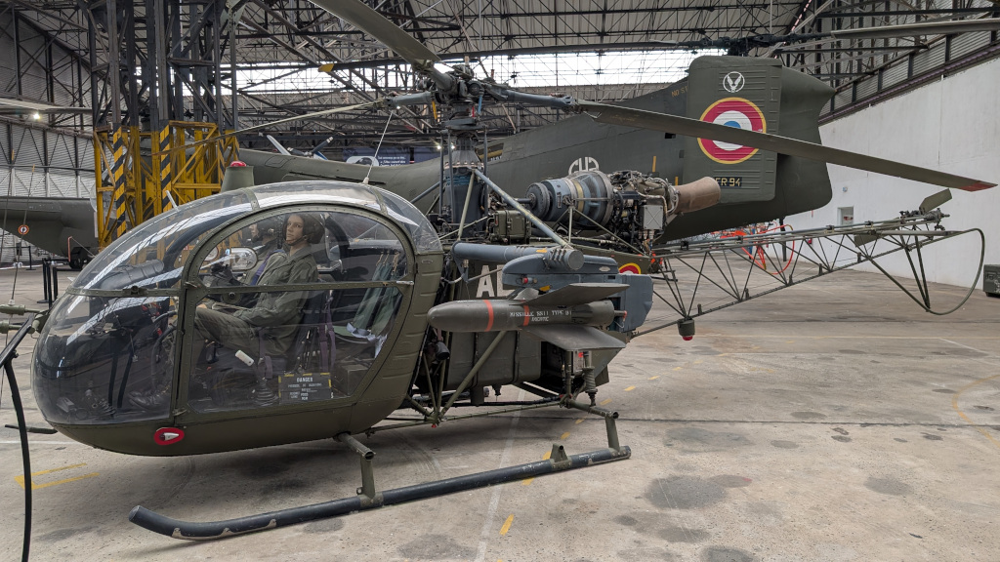

# Histoire

L'Alouette II n'était pas destinée à devenir une légende. Conçue au milieu des années 1950 par la Société nationale des constructions aéronautiques du Sud-Est (SNCASE) sous la direction de l'ingénieur Charles Marchetti, elle fit son premier vol le 12 mars 1955 à Buc, aux mains du pilote d'essai Jean Boulet. Ce jour-là et pour la première fois, un hélicoptère de série volait grâce à une turbine à gaz.

La turbine Turboméca Artouste IIC changea tout : plus légère, plus fiable, moins gourmande en carburant, elle ouvrit à l'hélicoptère des altitudes que la génération précédente ne pouvait qu'imaginer. Jean Boulet battit en juin 1955 le record mondial d'altitude pour hélicoptère en portant l'Alouette II à 8 209 mètres. La montagne, jusque-là hors de portée, devenait accessible à l'aviation.

La Gendarmerie nationale fut l'une des premières à l'utiliser dès 1957. L'armée de l'air, la Marine puis les armées d'une trentaine de pays suivirent. Plus de 1 300 appareils furent construits entre 1956 et 1975. Certains volent encore aujourd'hui.

_Alouette II SNCASE SE.3130 - Musée de l'ALAT et de l'hélicoptère - Dax (40)_

Au cinéma, les Alouette apparaissent dans plusieurs films à partir des années 60.

## Films français

Tout l'or du monde (1961), Le Fanfaron (1962), Fantômas (1964), Le Grand Restaurant (1966), Le Tatoué (1968) avec Louis de Funès, La Horse (1969), Le Cerveau (1969), Peau d'Âne (1970), Le Gendarme en balade (1970), Le Far West (1972) avec Jacques Brel, Le Guignolo (1980) avec Jean-Paul Belmondo, La Fille de l'air (1992), Les Rivières pourpres (2000), Les Vacances du Petit Nicolas (2014).

## Films internationaux

On ne vit que deux fois (James Bond, 1967), Chacal (1973), Octopussy (James Bond, 1983), OSS 117 - Atout cœur à Tokyo (1966), Tintin et le Temple du Soleil (1969), Le Cercle rouge (1970), Cassandra Crossing (1976).

Source : [alouettelama.com](https://www.alouettelama.com)
